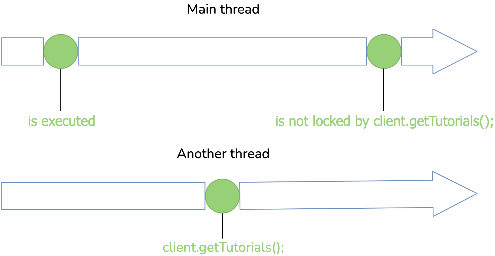
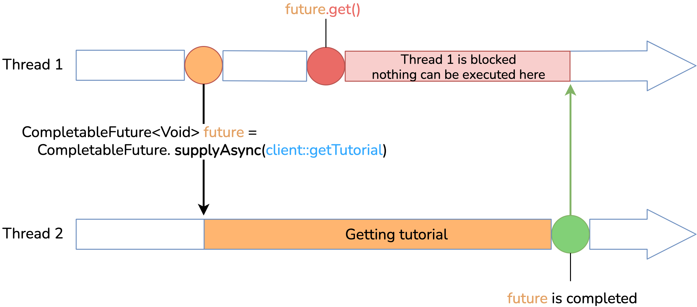
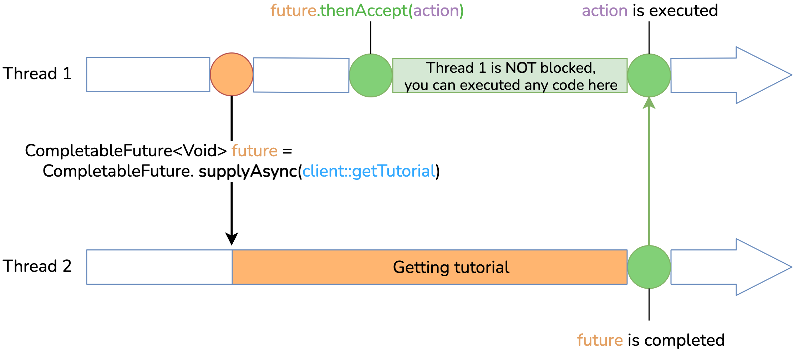

class Tutorial {
private String name;

    // constructors, getters and setters
}

interface Client {

    List<Tutorial> getTutorials();
}

public void printTutorialsCount() {

    List<Tutorial> tutorials = client.getTutorials();
    logger.info("Number of tutorials: " + tutorials.size());
}

Non async

Asynchronous approach

get()

thenAccept()

