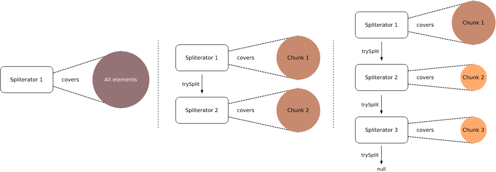

Performance of parallel streams

As you've already seen, it is not difficult to make a stream parallel. However, you shouldn't make every stream parallel, because the performance of a parallel stream depends on multiple factors and, sometimes, a parallel stream can be even slower than the equivalent sequential stream.

Let's consider some factors that affect the performance of parallel streams and must be taken into account before turning streams into parallel.

Boxing/Unboxing. Primitive values are processed faster than boxed values. So, IntStream, LongStream and DoubleStream as parallel streams are a bit more preferable than Stream<T>.

The number of available cores at runtime. The more cores are available → the greater speedup. At least > 1 CPU core is a must have to overcome the management overhead.

Size of data. The bigger size of data → the greater speedup. However there are also some exceptions.

Cost per element processing. The longer each element is processed → the more efficient parallelization. But it is not recommended to use parallel streams for too long operations (e.g., network interactions).

Large N*Q factor. The previous two factors can be restated as a single formula that means that the value of  "number of elements" * "cost per element" should be large to get more benefits of the parallelization. When a collection is quite small, we need to have more cost per element processing to get speedup. At the same time, if the operation per element has a low CPU cost, we need a huge collection with such elements to get speedup.

The type of data source. The easier the datasource can be separated into parts → the greater speedup. For example, standard arrays, ArrayList, and IntStream.range are good sources for data splitting as they support random access. Others, such as LinkedList, Stream.iterate, BlockingQueue or most IO-based sources are bad for data splitting.

Type of operations: stateless or stateful. Stateless operations (for example, filter and map) are better for parallel processing than stateful operations (for example, distinct, sorted, limit). Operations that are based on the order of elements are especially hard for parallelization, but it's not always possible to avoid them.

All the listed factors give us only an approximate estimate, some reference points to be considered. When developing a real application, you need to perform some measurements to decide whether to use parallel streams in a particular case. Also, you have to decide if you are ready to spend additional server threads in production.

There are also some other circumstances when you should not parallel your streams. If your streams need to call a synchronized method or code block, then it probably wouldn't have benefit from the parallelization due to the fact that your parallel streams will wait on this synchronization barrier. The same problem occurs when you’re calling blocking i/o operations.

Summarizing all of the above, we should note that parallel streams are not always faster than equivalent sequential streams and their performance depends on many factors: the volume of data, the hardware, the operations you will use, etc. It can be quite difficult to predict the speedup without performing real measurements. If there are enough computer resources or the operations are pretty simple, it may preferable to use a sequential stream. However, if you've achieved a measurable stable speedup, you can incorporate parallel streams into your code.

SPLITERATOR
